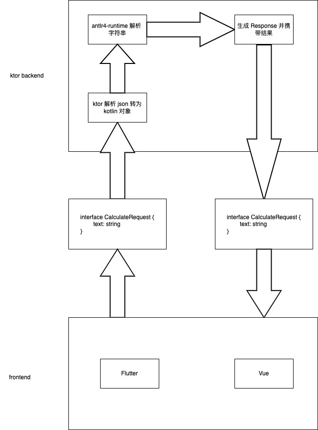

# Calculator

## Introduction

这是一个计算器程序，采用前后端分离框架，最重要的功能就是后端的 **解析表达式** 和 **求值** 功能\
这个项目可以作为一个 **project-based-learning** 项目，同时也是一个 [app-ideas](https://github.com/florinpop17/app-ideas) 的 [calculator](https://github.com/florinpop17/app-ideas/blob/master/Projects/1-Beginner/Calculator-App.md) 项目的实现\
这个项目的架构图如下

这个项目所包含的技术栈包括

1. 后端
    - kotlin
    - ktor
    - antlr4-runtime
2. 前端 with Flutter
3. 前端 with Vue and Vuetify

其中前端都采用 **Material Design 3** 样式，因为要做到界面统一，这样学习成本能低点
